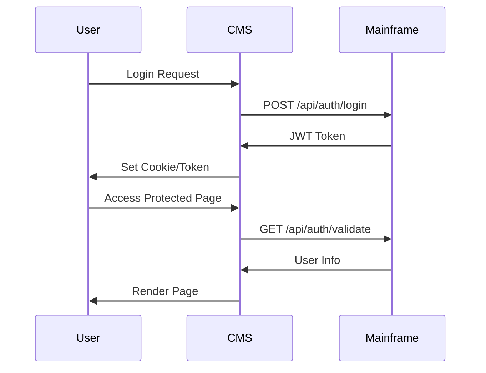
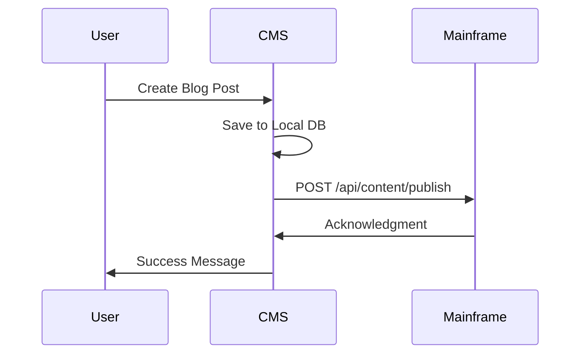

# AGP_CMS Module - Plug and Play Architecture

## Overview

AGP_CMS is now a fully modular, plug-and-play CMS system that can be:
- **Integrated** into ASHATCore as a module
- **Split off** as a standalone web application
- **Connected** to ASHAT Mainframe via well-defined APIs

## Architecture

### Module Structure

```
AGP_CMS/
├── API/                    # REST API layer for mainframe communication
│   ├── CMSAPIManager.cs
│   ├── CMSAPIModels.cs
│   └── AIChatbotManager.cs
├── Components/             # Razor Components for CMS UI
│   ├── BlogPostCard.razor
│   └── ForumPost.razor
├── Configuration/          # CMS configuration management
│   └── CMSConfiguration.cs
├── Core/                   # Core module interfaces and implementations
│   ├── IAGP_CMSModule.cs
│   ├── AGP_CMSModule.cs
│   ├── ICMSComponent.cs
│   └── AGP_CMSExtensions.cs
├── Pages/                  # Razor Pages for CMS functionality
│   ├── Blogs/
│   ├── Forums/
│   ├── Profiles/
│   └── _ViewImports.cshtml
├── Plugins/                # Plugin system for extensibility
│   ├── ICMSPlugin.cs
│   └── PluginManager.cs
└── Security/              # RBAC and security features
    └── RBACManager.cs
```

## Usage Modes

### Mode 1: Integrated Module (Current)

AGP_CMS runs as an integrated module within ASHATCore:

```csharp
// In ASHATCore Program.cs
builder.Services.AddAGP_CMS();

// ...

app.UseAGP_CMS();
app.MapRazorPages(); // Maps all Razor Pages including AGP_CMS pages
```

**Benefits:**
- Single deployment
- Shared authentication and session management
- Direct in-process communication
- Shared resources and configuration

### Mode 2: Standalone Application

AGP_CMS can be split off as a standalone web application:

1. **Create a new project:**
   ```bash
   dotnet new web -n AGP_CMSApp
   cd AGP_CMSApp
   dotnet add reference ../AGP_CMS/AGP_CMS.csproj
   ```

2. **Configure Program.cs:**
   ```csharp
   using AGP_CMS.Core;

   var builder = WebApplication.CreateBuilder(args);
   
   // Add AGP_CMS services
   builder.Services.AddAGP_CMS();
   
   var app = builder.Build();
   
   app.UseStaticFiles();
   app.UseRouting();
   app.UseAGP_CMS();
   app.MapRazorPages();
   
   app.Run();
   ```

3. **Configure API endpoint for mainframe:**
   ```json
   {
     "AGP_CMS": {
       "MainframeApiUrl": "https://ashat-mainframe.local/api",
       "ApiKey": "your-api-key",
       "Mode": "Standalone"
     }
   }
   ```

**Benefits:**
- Independent deployment and scaling
- Can be hosted on separate infrastructure
- Isolated failure domains
- Easier updates and maintenance

### Mode 3: Microservice Architecture

AGP_CMS communicates with ASHAT Mainframe via REST APIs:

**CMS → Mainframe API Endpoints:**
- `POST /api/auth/validate` - Validate user tokens
- `GET /api/users/{id}` - Get user information
- `POST /api/content/publish` - Publish content to mainframe
- `GET /api/modules/status` - Check mainframe module status

**Mainframe → CMS API Endpoints:**
- `GET /api/cms/health` - CMS health check
- `GET /api/cms/content` - Retrieve CMS content
- `POST /api/cms/webhook` - Receive mainframe events

## API Boundaries

### Authentication Flow



### Content Publishing Flow



## Configuration

### Integrated Mode Configuration

```json
{
  "AGP_CMS": {
    "Mode": "Integrated",
    "Database": {
      "Type": "SQLite",
      "ConnectionString": "Data Source=cms.db"
    },
    "Features": {
      "Blogs": true,
      "Forums": true,
      "Profiles": true
    }
  }
}
```

### Standalone Mode Configuration

```json
{
  "AGP_CMS": {
    "Mode": "Standalone",
    "MainframeApiUrl": "https://ashat-mainframe.local/api",
    "ApiKey": "${MAINFRAME_API_KEY}",
    "Database": {
      "Type": "SQLite",
      "ConnectionString": "Data Source=cms.db"
    },
    "Authentication": {
      "UseMainframeAuth": true,
      "JwtSecret": "${JWT_SECRET}"
    },
    "Features": {
      "Blogs": true,
      "Forums": true,
      "Profiles": true
    }
  }
}
```

## Routing

### Integrated Mode Routes

When integrated, CMS pages are accessible at:
- `/cms/blogs` - Blog system
- `/cms/forums` - Forum platform
- `/cms/profiles` - User profiles

### Standalone Mode Routes

When standalone, CMS pages are accessible at root:
- `/blogs` - Blog system
- `/forums` - Forum platform
- `/profiles` - User profiles

Route prefix can be configured:
```csharp
services.AddRazorPages()
    .AddRazorPagesOptions(options =>
    {
        options.Conventions.AddPageRoute("/Blogs/Index", "");
    });
```

## Splitting Off the Project

### Step-by-Step Guide

1. **Create new solution:**
   ```bash
   mkdir AGP_CMSStandalone
   cd AGP_CMSStandalone
   dotnet new sln -n AGP_CMS
   ```

2. **Copy AGP_CMS project:**
   ```bash
   cp -r ../ASHATOS/AGP_CMS .
   cp -r ../ASHATOS/Abstractions .
   dotnet sln add AGP_CMS/AGP_CMS.csproj
   dotnet sln add Abstractions/Abstractions.csproj
   ```

3. **Create host application:**
   ```bash
   dotnet new web -n AGP_CMSHost
   dotnet sln add AGP_CMSHost/AGP_CMSHost.csproj
   cd AGP_CMSHost
   dotnet add reference ../AGP_CMS/AGP_CMS.csproj
   ```

4. **Configure Program.cs in host:**
   See "Mode 2: Standalone Application" above

5. **Build and run:**
   ```bash
   dotnet build
   dotnet run --project AGP_CMSHost
   ```

## Maintaining Mainframe Connectivity

When running standalone, AGP_CMS maintains connectivity through:

### 1. HTTP Client Configuration

```csharp
public class MainframeApiClient
{
    private readonly HttpClient _httpClient;
    private readonly string _apiKey;

    public MainframeApiClient(IConfiguration config)
    {
        _httpClient = new HttpClient
        {
            BaseAddress = new Uri(config["AGP_CMS:MainframeApiUrl"])
        };
        _apiKey = config["AGP_CMS:ApiKey"];
    }

    public async Task<User?> ValidateTokenAsync(string token)
    {
        var request = new HttpRequestMessage(HttpMethod.Post, "/api/auth/validate");
        request.Headers.Add("Authorization", $"Bearer {token}");
        request.Headers.Add("X-API-Key", _apiKey);
        
        var response = await _httpClient.SendAsync(request);
        if (!response.IsSuccessStatusCode) return null;
        
        return await response.Content.ReadFromJsonAsync<User>();
    }
}
```

### 2. Event Publishing

```csharp
public class ContentPublisher
{
    private readonly MainframeApiClient _apiClient;

    public async Task PublishContentAsync(BlogPost post)
    {
        var request = new ContentPublishRequest
        {
            Type = "BlogPost",
            Id = post.Id,
            Title = post.Title,
            Content = post.Content,
            Author = post.Author,
            PublishedDate = post.PublishedDate
        };

        await _apiClient.PostAsync("/api/content/publish", request);
    }
}
```

### 3. Webhook Handlers

```csharp
app.MapPost("/api/cms/webhook", async (WebhookEvent evt) =>
{
    // Handle events from mainframe
    switch (evt.Type)
    {
        case "user.created":
            await cmsService.SyncUserAsync(evt.Data);
            break;
        case "content.updated":
            await cmsService.RefreshContentAsync(evt.Data);
            break;
    }
    
    return Results.Ok();
});
```

## Benefits of Modular Architecture

### For Developers
- ✅ Clear separation of concerns
- ✅ Independent testing and development
- ✅ Easier code navigation
- ✅ Faster build times (when split)

### For Operators
- ✅ Flexible deployment options
- ✅ Independent scaling
- ✅ Easier updates and rollbacks
- ✅ Better resource allocation

### For Users
- ✅ Consistent experience across modes
- ✅ Better performance (dedicated resources in standalone mode)
- ✅ Higher availability (isolated failure domains)

## Migration Path

Existing installations can migrate gradually:

1. **Phase 1:** Use integrated mode (current state)
2. **Phase 2:** Test standalone mode in development
3. **Phase 3:** Deploy standalone for CMS-heavy workloads
4. **Phase 4:** Full microservices if needed

## Support

For issues and questions about the modular architecture:
- See main ASHATOS documentation
- Check API documentation
- Review troubleshooting guide

---

**Version:** 8.1.0  
**Last Updated:** 2025-11-08  
**Status:** Production Ready
